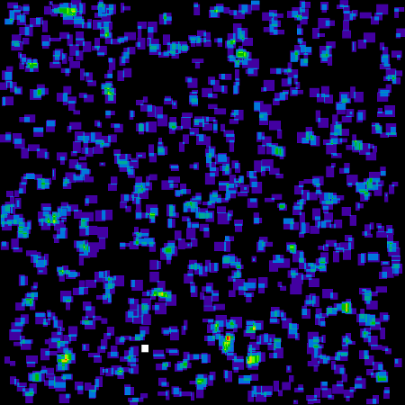
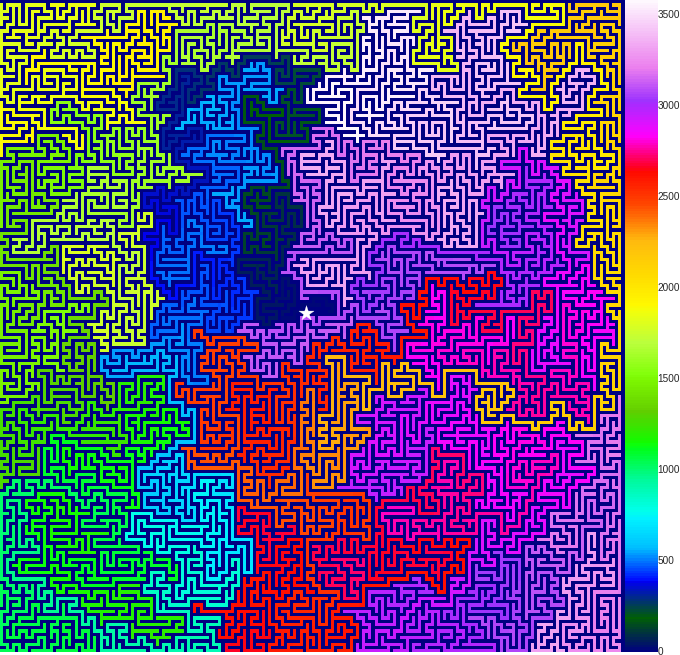
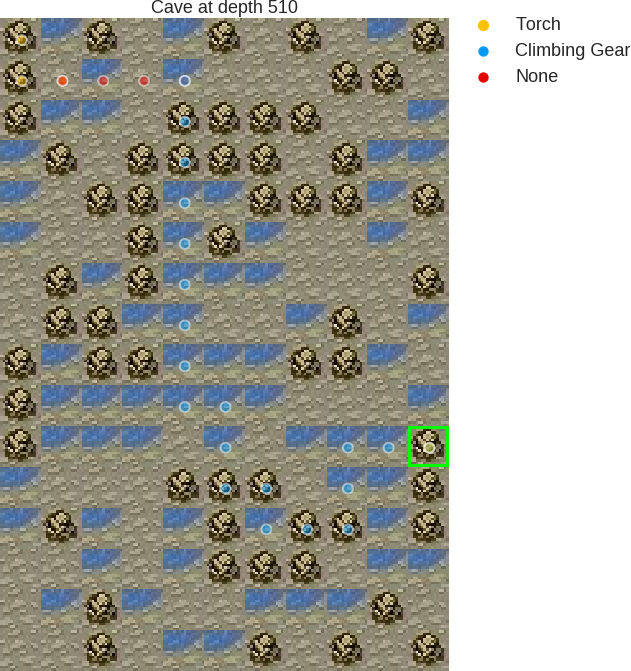

# Advent of Code 2018    

My Python solution to Advent of Code 2018. Each day is in a separate notebook for easy vizualisation, and the full code is also available in Colaboratory notebook. [More information about the challenge here.](https://adventofcode.com/2018)

> **Advent of Code** is an Advent calendar of **small programming puzzles** for a variety of skill sets and skill levels that can be solved in any programming language you like. 
People use them as a speed contest, interview prep, company training, university coursework, practice problems, or to challenge each other

<table style='text-align:center'>
 <tr>
  <td colspan="4" align='center'><b>Links to Solutions</b></td>
 </tr>
 
 <tr>
  <td>
   <ul>
    <li> [X] 🎅 <a href="https://github.com/ameroyer/advent_of_code_2018/blob/master/day01.ipynb">Day 1</a>
    <li> [X] 🎁 <a href="https://github.com/ameroyer/advent_of_code_2018/blob/master/day02.ipynb">Day 2</a>
    <li> [X] 🎄 <a href="https://github.com/ameroyer/advent_of_code_2018/blob/master/day03.ipynb">Day 3</a>
    <li> [X] 🌠 <a href="https://github.com/ameroyer/advent_of_code_2018/blob/master/day04.ipynb">Day 4</a>
    <li> [X] 🍰 <a href="https://github.com/ameroyer/advent_of_code_2018/blob/master/day05.ipynb">Day 5</a>
    <li> [X] ☃️ <a href="https://github.com/ameroyer/advent_of_code_2018/blob/master/day06.ipynb">Day 6</a>
   </ul>
  </td>
  
  <td>
   <ul>
    <li> [X] ❄️ <a href="https://github.com/ameroyer/advent_of_code_2018/blob/master/day07.ipynb">Day 7</a>
    <li> [X] ✨ <a href="https://github.com/ameroyer/advent_of_code_2018/blob/master/day08.ipynb">Day 8</a> 
    <li> [X] 💗 <a href="https://github.com/ameroyer/advent_of_code_2018/blob/master/day09.ipynb">Day 9</a>
    <li> [X] 🍬 <a href="https://github.com/ameroyer/advent_of_code_2018/blob/master/day10.ipynb">Day 10</a> 
    <li> [X] ⛄ <a href="https://github.com/ameroyer/advent_of_code_2018/blob/master/day11.ipynb">Day 11</a>
    <li> [X] 🎆 <a href="https://github.com/ameroyer/advent_of_code_2018/blob/master/day12.ipynb">Day 12</a> 
   </ul>
  </td>
  
  <td>
   <ul>
    <li> [X] 🍭 <a href="https://github.com/ameroyer/advent_of_code_2018/blob/master/day13.ipynb">Day 13</a>
    <li> [X] ☕ <a href="https://github.com/ameroyer/advent_of_code_2018/blob/master/day14.ipynb">Day 14</a> 
    <li> [X] 🌰 <a href="https://github.com/ameroyer/advent_of_code_2018/blob/master/day15.ipynb">Day 15</a>
    <li> [X] 🎶 <a href="https://github.com/ameroyer/advent_of_code_2018/blob/master/day16.ipynb">Day 16</a> 
    <li> [X] 🏂 <a href="https://github.com/ameroyer/advent_of_code_2018/blob/master/day17.ipynb">Day 17</a>
    <li> [X] 🍠 <a href="https://github.com/ameroyer/advent_of_code_2018/blob/master/day18.ipynb">Day 18</a> 
   </ul>
  </td>
    
  <td>
   <ul>
    <li> [X] 🍫 <a href="https://github.com/ameroyer/advent_of_code_2018/blob/master/day19.ipynb">Day 19</a>
    <li> [X] 👪 <a href="https://github.com/ameroyer/advent_of_code_2018/blob/master/day20.ipynb">Day 20</a> 
    <li> [X] 🍪 <a href="https://github.com/ameroyer/advent_of_code_2018/blob/master/day21.ipynb">Day 21</a>
    <li> [X] 🎀 <a href="https://github.com/ameroyer/advent_of_code_2018/blob/master/day22.ipynb">Day 22</a> 
    <li> [X] 💤 <a href="https://github.com/ameroyer/advent_of_code_2018/blob/master/day23.ipynb">Day 23</a>
    <li> [X] 🎉 <a href="https://github.com/ameroyer/advent_of_code_2018/blob/master/day24.ipynb">Day 24</a>
   </ul>
  </td>
 </tr>
</table>

### Some visualizations

<table>
 <tr>
  <td align="center"><b>[Day 3]</b></td>
  <td align="center"><b>[Day 6]</b></td>
 </tr>
 <tr>
  <td align="center">Fabric sheet and claimed patches</td>
  <td align="center">Finite and infinite regions</td>
 </tr>
 <tr>
  <td></td>
  <td></td>
 </tr>
</table>

<table>
 <tr>
  <td align="center"><b>[Day 20]</b></td>
  <td align="center"><b>[Day 22]</b></td>
 </tr>
 <tr>
  <td align="center">Mapped maze and distance heatmap</td>
  <td align="center">Map of the cave and shortest rescue path</td>
 </tr>
 <tr>
  <td></td>
  <td></td>
 </tr>
</table>

<table>
 <tr>
  <td align="center"><b>[Day 15]</b></td>
 </tr>
 <tr>
  <td align="center">Excerpt of the game unfolding</td>
 </tr>
 <tr>
  <td></td>
 </tr>
</table>

<table>
 <tr>
  <td align="center"><b>[Day 24]</b></td>
 </tr>
 <tr>
  <td align="center">Playing with emojis</td>
 </tr>
 <tr>
  <td>
   <b>Round 0 - Start</b>
   <ul>
<li> [G01 😇] [17/17 units] 5390 HP - 4507 🔥 DMG - RECEIVE: (☢: 2, 💫: 1, ❄ 1, 👊: 2, 🔥: 1)
<li>[G02 😇] [989/989 units] 1274 HP - 25 💫 DMG - RECEIVE: (☢: 1, 💫: 2, ❄ 1, 👊: 2, 🔥: 0)
<li>[G01 😈] [801/801 units] 4706 HP - 116 👊 DMG - RECEIVE: (☢: 2, 💫: 1, ❄ 1, 👊: 1, 🔥: 1)
<li>[G02 😈] [4485/4485 units] 2961 HP - 12 💫 DMG - RECEIVE: (☢: 0, 💫: 1, ❄ 2, 👊: 1, 🔥: 2)
   </ul>

<b>Round 1</b>
   <ul>
<li>[G01 😇] [17/17 units], [G02 😇] [989/989 units], [G01 😈] [801/801 units], [G02 😈] [4485/4485 units]
<li>[G02 😈] ⚔ (107640 💫) (-84 units) [G02 😇], [G02 😇] ⚔ (22625 💫) (-4 units) [G01 😈], [G01 😇] ⚔ (153238 🔥) (-51 units) <li>[G02 😈], [G01 😈] ⚔ (184904 👊) (-34 units) [G01 😇]
   </ul>

<b>Round 2</b>
   <ul>
<li>[G02 😇] [905/989 units], [G01 😈] [797/801 units], [G02 😈] [4434/4485 units]
<li>[G02 😇] ⚔ (22625 💫) (-4 units) [G01 😈], [G01 😈] ⚔ (183976 👊) (-144 units) [G02 😇]
   </ul>

<b>Round 3-8</b>
   <ul>
<li>...
   </ul>

<b>Round 8 - End</b>
   <ul>
<li>[G01 😈] [782/801 units] 4706 HP - 116 👊 DMG - RECEIVE: (☢: 2, 💫: 1, ❄ 1, 👊: 1, 🔥: 1)
<li>[G02 😈] [4434/4485 units] 2961 HP - 12 💫 DMG - RECEIVE: (☢: 0, 💫: 1, ❄ 2, 👊: 1, 🔥: 2)
   </ul>

<b>Winning team</b>: Infection (😈)
 <b>Remaining units</b>: 5216
</td>
 </tr>
</table>
